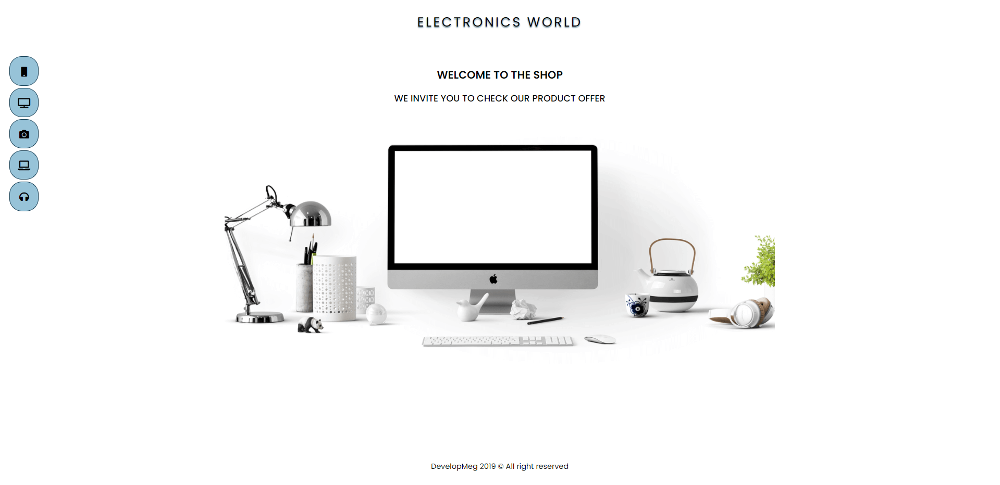
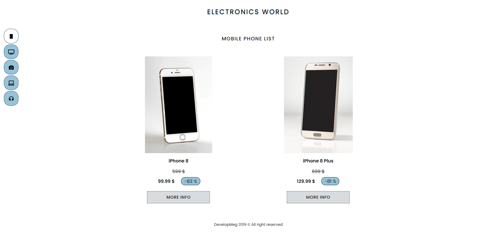
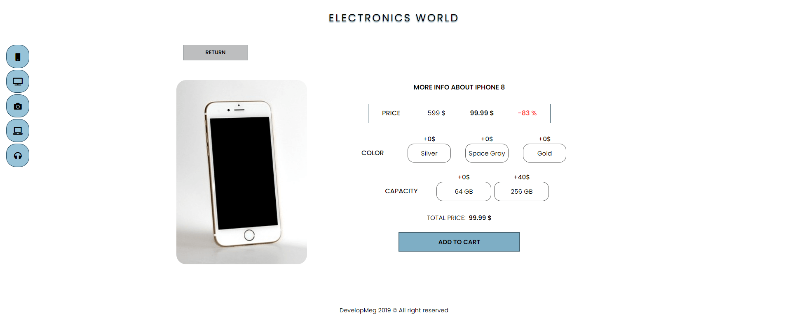
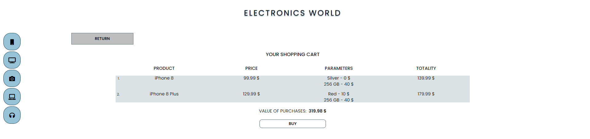

# electronics-world

> This is my old project (which doesn`t contain aspects I learned from feedback), but shows progress of my skills

#### This is mini online shop (works only for mobile phones), it was recruitment task

Link: https://developmeg.github.io/electronics-world/

---

## Technologies

- React (Create React App)
- React Router
- SCSS
- BEM

#### Extra Packages

- react-input-mask

## Installation

Clone this repository and install dependencies: `npm install`

Next run application on your localhost: `npm start`

To build project : `npm run build`
